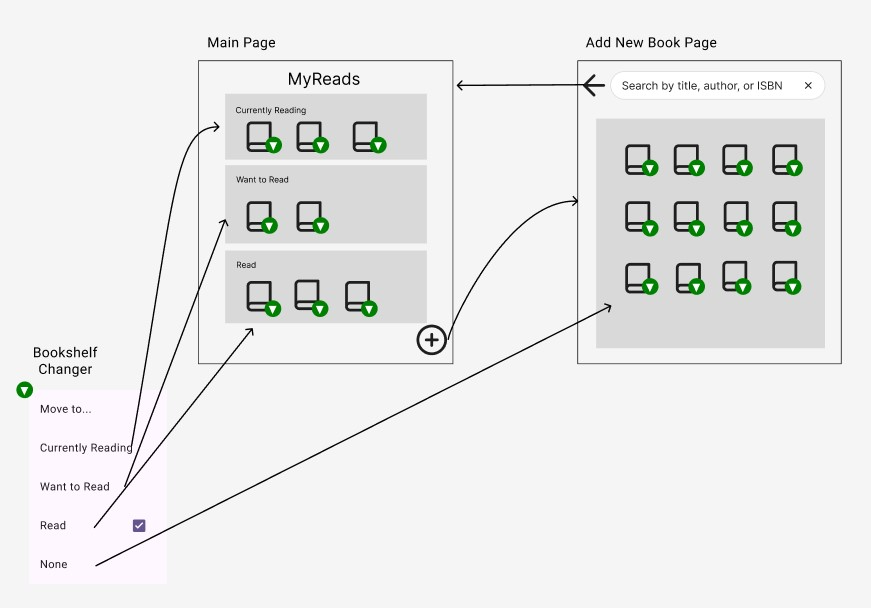
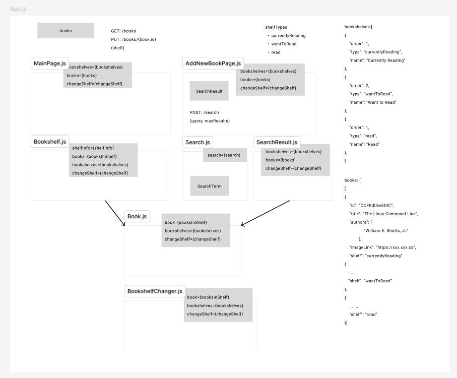

# MyReads Project

## Overview

MyReads is a bookshelf application that allows users to organize and categorize their books. Built with React, this app provides an intuitive interface for managing your personal library.


## TL;DR

To get started developing right away:

- install all project dependencies with `npm install`
- start the development server with `npm start`


## Key Features:

1. **Book Categorization**: Organize books into three shelves:
   - Currently Reading
   - Want to Read
   - Read

2. **Interactive Shelf Management**: Easily move books between shelves using a dropdown control for each book.

3. **Search Functionality**: Access a search page to find and add new books to your shelves.

4. **Synchronized State**: Book states are consistent between the main page and search results.

5. **Real-time Updates**: Changes made on the search page are instantly reflected on the main page.

## App Structure:


- **Main Page (`/`)**: 
  - Displays your book shelves and their contents
  - Provides a link to the search page

- **Add New Book Page (`/search`)**: 
  - Allows you to search for new books
  - Add books directly to your shelves
  - Navigate back to the main page

## Technology:

- Built with React
- Utilizes a provided API server and client library for data persistence

This project emphasizes React fundamentals, state management, and working with external APIs to create a dynamic and responsive web application.


## Components


The MyReads application consists of the following main components:

### 1. App.js
- Root component of the application
- Responsible for routing and global state management
- State:
  - books: Current books

### 2. MainPage.js
- Component for the main page
- Props:
  - bookshelves: Information about the bookshelves
  - books: List of books to display
  - changeShelf: Function to change a book's shelf

### 3. AddNewBookPage.js
- Component for the page to add new books by search
- Props:
  - bookshelves: Information about the bookshelves
  - books: Current list of books
  - changeShelf: Function to change a book's shelf
- State:
  - searchResult: Search result

### 4. Bookshelf.js
- Component to display individual bookshelves
- Props:
  - shelfInfo: Information about the specific shelf
  - books: List of books belonging to this shelf
  - bookshelves: Information about all bookshelves
  - changeShelf: Function to change a book's shelf

### 5. Book.js
- Component to display individual books
- Props:
  - book: Information about the book
  - bookshelves: Information about all bookshelves
  - changeShelf: Function to change a book's shelf

### 6. BookshelfChanger.js
- Dropdown component to change a book's shelf
- Props:
  - book: Information about the book
  - bookshelves: Information about all bookshelves
  - changeShelf: Function to change a book's shelf

### 7. Search.js
- Component for the Add New Book page
- State:
  - searchTerm: Search query

### 8. SearchResult.js
- Component to display search results
- Props:
  - bookshelves: Information about the bookshelves
  - books: List of books from search results
  - changeShelf: Function to change a book's shelf

### Data Flow
- `App.js` uses the `GET /books` API to fetch book information and passes it to `MainPage.js` and `AddNewBookPage.js`.
- The `changeShelf` function is defined in `App.js` and passed down to child components to manage book movements.
- The search functionality is implemented in `AddNewBookPage.js`, using the `POST /search` API to fetch results and passed down to `Search.js`.

This structure enhances component reusability and clarifies the data flow. State management for books is primarily handled in `App.js` and passed down to child components as needed.


## Backend Server

To simplify your development process, we've provided a backend server for you to develop against. The provided file [`BooksAPI.js`](src/BooksAPI.js) contains the methods you will need to perform necessary operations on the backend:

- [`getAll`](#getall)
- [`update`](#update)
- [`search`](#search)

### `getAll`

Method Signature:

```js
getAll();
```

- Returns a Promise which resolves to a JSON object containing a collection of book objects.
- This collection represents the books currently in the bookshelves in your app.

### `update`

Method Signature:

```js
update(book, shelf);
```

- book: `<Object>` containing at minimum an `id` attribute
- shelf: `<String>` contains one of ["wantToRead", "currentlyReading", "read"]
- Returns a Promise which resolves to a JSON object containing the response data of the POST request

### `search`

Method Signature:

```js
search(query);
```

- query: `<String>`
- Returns a Promise which resolves to a JSON object containing a collection of a maximum of 20 book objects.
- These books do not know which shelf they are on. They are raw results only. You'll need to make sure that books have the correct state while on the search page.


